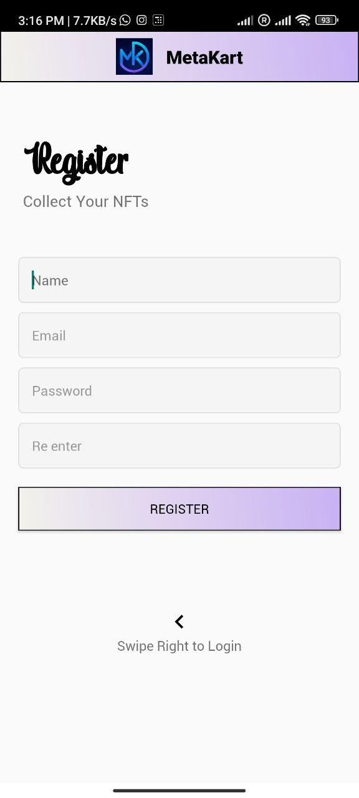
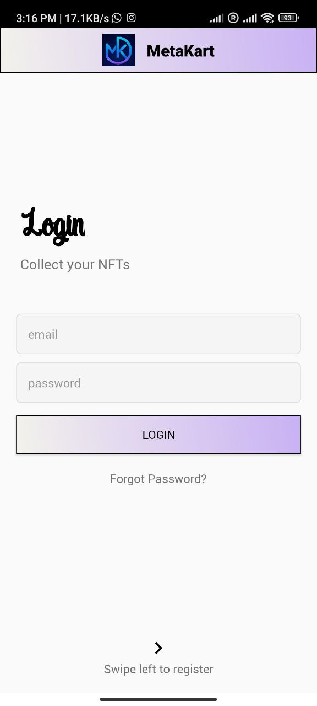
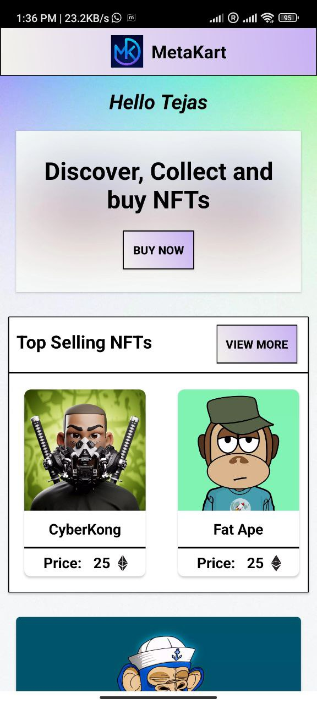

# MetaKart
<i> PROG8350 Application Development for Android </i>
#### Android application developed using Java and it's a basic eCommerce application with realtime database to handle products in a dynamic way. The application allows users to display items and to add to cart for purchase. The project was developed using Agile Methodology and completely adheres to GitFlow to avoid merge conflicts among team members working on the same feature and to maintain clean and tidy code.

# Splash, Signup and Login

#### The application comprises of animated splash screen followed with login and signup authentication using Firebase Authentication.

  
   
  

# Dashboard, List of Products and Product Details

#### The application comprises of listing of products with it's details. The dashboard Activity allows users to see products in RecyclerView and product details actvity, with the use of Firebase to display real time data in android application from database.

  
   
  

# Product Details and Checkout Activity

#### Finally, users can checkout their items by adding their personal information and do checkout.

   
  

